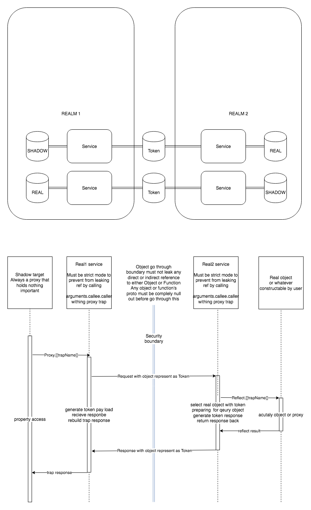

# Secure ECMAScript Sandbox experiment (not done yet)

## Design

### Don't expose data unnecessarily

Instead of trying to wrap the data so attacker can't access the real data.  

*WE SHUT THE DOOR DOWN DIRECTLY.*

And trying to expose just **minimal** data that are **enough** to simulate all behavior we want in the iframe through a mini window.

### Security should be enforced on the server side

As everybody know, it is silly to enforce security on client side.

The library copy installed inside the iframe must be only responsible to emulate object behavior properly instead of security things.

Just don't ever try to send information that the iframe shouldn't know to the iframe,  
and the iframe will never get it.

### The current context hate you, and the iframe also hate you.

Don't ever trust any object/function if it is not created by you or it does not have null prototype.

Every object can be a big surprise when doing anything, because we now have something called `Proxy`.

## Terminology
1. world  
    - Realm, Environment, whatever that mean the entire context running current script
    - e.g. iframe or new window
2. service
    - This library
    - Responsible for creating the shadow object
        - And relay object query to service in another world
    - Responsible for remember token <-> real object relationship
        - And handling property query from service in another world
    - Must be initialized per world
3. real object
    - The object in current world that want to be proxied to another world
4. token
    - handle that represent real object
5. shadow object
    - The fake object(proxy) that map to the real object in another world

## Principle
1. shadow object includes service itself must be initiate in the same world
    - So it can't leak constructor and whatever
    - `Even the service itself is untrustworthy`
2. service must not leak real object and any object prototype to service in another world
    - Object must be represent as token when communicate with service in another world
    - Minimize the attack surface
    - So you still can't get the real object even the service itself is pwned
    - `Even the service itself is untrustworthy`
3. drop real ref toward another world ASAP before actual untrustworthy script running
4. rules also applied to custom configuration in configure hooks
    - It has exact the same privilege as service itself,  
        the proxy also being completely pwned if the custom configurations are unsafe.

## Rules to stop world escape
1. passing any object(include function) that has `__proto__` through the `service.[[method name]]` is not allowed
    - It will leak the `Object` thus `Function` thus allow escaping from another world to current world
2. object that pass to other world must be frozen
    - Stop the redefine getter/setter attack

## Rules to prevent same world script break the service
1. using any global variable inside the `init` function in not allowed
2. using any prototype method/property is not allowed (includes the \[\[Symbol.iterator]])
    - e.g. `[...array]`, `weakMap.set`, `[].push('something')`
3. any function/object that has `__proto__` must not be the left hand of property assignment
    - e.g. `({}).prop = 'whatever'`
    - It cause script run in same world able to add getter to the `Object.prototype` and break service

## Architecture



# Security Warning

## Edge
Edge Current always leak buildins through Function.caller because all buildins are non strict function.  
Makes it completely impossible to safely access untrustworthy object property descriptor

### POC:

```js
const foo = { bar: 1 }
function getOwnPropertyDescriptor () {
    console.log('caller be', arguments.callee.caller)
}
const untrustworthyObject = new Proxy(foo, {
    getOwnPropertyDescriptor
})

const safeGetDescriptor = (baz) => {
    'use strict'
    Reflect.getOwnPropertyDescriptor(baz, 'bar')
}

safeGetDescriptor(untrustworthyObject)
```

### Result under Edge 44.18362.449.0

```txt
caller be function getOwnPropertyDescriptor() { [native code] }
```

### See also

https://github.com/Jack-Works/proposal-strict-built-in-functions

## chrome (and maybe other)

Chrome(and maybe other) leak Function/Object through stack overflow. because chrome decide the prototype of `RangeError` by the `function being called` instead of the `caller`.

So leaking the `Token` to sandbox is never allowed currently or the sandbox will be completely pwned.

May be also exploitable on firefox, but firefox randomized the stack size. So these kind of exploit can't be done reliable. (Will likely requires thousands of try, and each one only has 0.01% chance to exploit the problem successfully)

### Poc

```html
<!DOCTYPE html>
<html lang="en">
<head>
    <meta charset="UTF-8">
    <meta name="viewport" content="width=device-width, initial-scale=1.0">
    <meta http-equiv="X-UA-Compatible" content="ie=edge">
    <title>Document</title>
</head>
<body>
    <script>
        let iframe = document.createElement('iframe')
        iframe.setAttribute('sandbox', 'allow-same-origin allow-scripts');
        iframe.style.display = 'none';
        document.body.append(iframe)
        iframe.contentWindow.eval('window.foo = () => {}')
        function getLimit (depth = 1) {
            try {
                return getLimit(depth + 1)
            } catch (err) {
                return depth
            }
        }
        console.log(getLimit())
        let err
        function exhaust(depth, cb) {
            try {
                if (depth > 0) {
                    exhaust(depth - 1, cb)
                } else {
                    cb()
                }
            } catch (_err) {
                err =_err
            }
        }
        exhaust(getLimit(), iframe.contentWindow.foo)
        console.log(err instanceof RangeError, err instanceof iframe.contentWindow.RangeError)
    </script>
</body>
</html>
```

### Result under Chrome 78.0.3904.108

```txt
false true
```